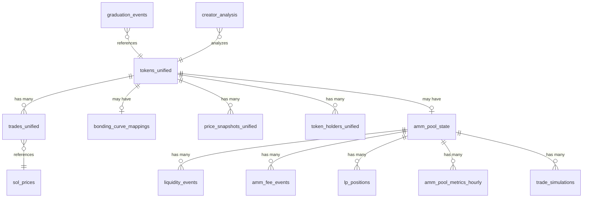

# Database Relationships Documentation

## Entity Relationship Overview



## Primary Relationships

### 1. Token-Centric Relationships

#### tokens_unified → trades_unified
- **Type**: One-to-Many
- **Foreign Key**: `trades_unified.mint_address` → `tokens_unified.mint_address`
- **Cardinality**: One token can have thousands of trades
- **Cascade**: None (trades preserved if token deleted)
- **Notes**: Trigger ensures token exists before trade insert

#### tokens_unified → bonding_curve_mappings
- **Type**: One-to-One (optional)
- **Foreign Key**: `bonding_curve_mappings.mint_address` → `tokens_unified.mint_address`
- **Cardinality**: BC tokens have mapping, AMM tokens don't
- **Use Case**: Maps bonding curve addresses to token mints

#### tokens_unified → amm_pool_state
- **Type**: One-to-One (optional)
- **Foreign Key**: `amm_pool_state.mint_address` → `tokens_unified.mint_address`
- **Cardinality**: Only graduated tokens have pools
- **Use Case**: Current AMM pool state for token

### 2. AMM Pool Relationships

#### amm_pool_state → liquidity_events
- **Type**: One-to-Many
- **Foreign Key**: `liquidity_events.pool_address` → `amm_pool_state.pool_address`
- **Cardinality**: Pools have many liquidity events
- **Use Case**: Track all add/remove liquidity actions

#### amm_pool_state → amm_fee_events
- **Type**: One-to-Many
- **Foreign Key**: `amm_fee_events.pool_address` → `amm_pool_state.pool_address`
- **Cardinality**: Pools collect many fees
- **Use Case**: Track fee collection over time

#### amm_pool_state → lp_positions
- **Type**: One-to-Many
- **Foreign Key**: `lp_positions.pool_address` → `amm_pool_state.pool_address`
- **Cardinality**: Multiple users hold LP tokens
- **Use Case**: Track LP token distribution

### 3. Time Series Relationships

#### tokens_unified → price_snapshots_unified
- **Type**: One-to-Many
- **Foreign Key**: `price_snapshots_unified.mint_address` → `tokens_unified.mint_address`
- **Cardinality**: Many snapshots per token
- **Use Case**: Historical price tracking

#### amm_pool_state → amm_pool_metrics_hourly
- **Type**: One-to-Many
- **Foreign Key**: `amm_pool_metrics_hourly.pool_address` → `amm_pool_state.pool_address`
- **Cardinality**: Hourly metrics per pool
- **Use Case**: Pool performance analytics

### 4. Analytics Relationships

#### creator_analysis → tokens_unified
- **Type**: Many-to-One
- **Logical Link**: `creator_analysis.creator_address` ← `tokens_unified.creator`
- **Cardinality**: One creator, many tokens
- **Use Case**: Creator reputation scoring

#### token_holders_unified → tokens_unified
- **Type**: Many-to-One
- **Foreign Key**: `token_holders_unified.mint_address` → `tokens_unified.mint_address`
- **Cardinality**: Many holders per token
- **Use Case**: Holder distribution analysis

## Complex Relationships

### Token Lifecycle Flow
```
1. Token Creation
   tokens_unified (first_seen)
   ↓
2. Bonding Curve Trading
   bonding_curve_mappings + trades_unified
   ↓
3. Graduation Event
   graduation_events → tokens_unified (graduated_to_amm = true)
   ↓
4. AMM Pool Creation
   amm_pool_state + amm_pool_states (historical)
   ↓
5. AMM Trading
   trades_unified (program = 'amm_pool')
   + liquidity_events
   + amm_fee_events
```

### Price Update Flow
```
trades_unified (INSERT)
    ↓
trigger_update_token_latest_prices
    ↓
tokens_unified (UPDATE)
    - latest_price_sol/usd
    - latest_market_cap_usd
    - last_trade_at
    - is_stale = false
    ↓
price_snapshots_unified (INSERT periodic)
```

## Referential Integrity

### Enforced Constraints
```sql
-- No orphaned trades (trigger enforced)
TRIGGER ensure_token_exists BEFORE INSERT ON trades_unified

-- Unique transaction signatures
UNIQUE INDEX ON trades_unified(signature)

-- Primary keys prevent duplicates
PRIMARY KEY ON tokens_unified(mint_address)
PRIMARY KEY ON amm_pool_state(pool_address)
```

### Logical Constraints (Application Enforced)
```sql
-- Graduated tokens should have AMM pool
CHECK (graduated_to_amm = false OR EXISTS(amm_pool_state))

-- BC progress should be 100% when graduated
CHECK (graduated_to_amm = false OR bonding_curve_progress >= 100)

-- Stale tokens shouldn't have recent trades
CHECK (is_stale = false OR last_trade_at < NOW() - INTERVAL '1 hour')
```

## Join Patterns

### Common Token Queries
```sql
-- Token with latest trade
SELECT t.*, tr.block_time as last_trade_time
FROM tokens_unified t
LEFT JOIN LATERAL (
    SELECT block_time 
    FROM trades_unified 
    WHERE mint_address = t.mint_address 
    ORDER BY block_time DESC 
    LIMIT 1
) tr ON true;

-- Token with pool state
SELECT t.*, p.*
FROM tokens_unified t
LEFT JOIN amm_pool_state p ON t.mint_address = p.mint_address
WHERE t.graduated_to_amm = true;
```

### Pool Analytics Queries
```sql
-- Pool with liquidity events
SELECT p.*, 
       COUNT(l.id) as liquidity_events,
       SUM(CASE WHEN l.event_type = 'add' THEN l.total_value_usd ELSE 0 END) as total_added_usd
FROM amm_pool_state p
LEFT JOIN liquidity_events l ON p.pool_address = l.pool_address
GROUP BY p.pool_address;

-- Pool hourly metrics with token info
SELECT t.symbol, t.name, m.*
FROM amm_pool_metrics_hourly m
JOIN amm_pool_state p ON m.pool_address = p.pool_address
JOIN tokens_unified t ON p.mint_address = t.mint_address
WHERE m.hour_timestamp >= NOW() - INTERVAL '24 hours';
```

## Data Integrity Rules

### 1. Token Consistency
- Every trade must have a corresponding token
- Token prices update automatically on trades
- Graduated tokens must have graduation timestamp

### 2. Pool Consistency
- Pool states must reference valid tokens
- Liquidity events must reference valid pools
- Fee events must match trade signatures

### 3. Time Consistency
- block_time should match slot ordering
- first_seen_at <= graduation_at (if graduated)
- last_trade_at >= first_seen_at

### 4. Price Consistency
- latest_price_* should match last trade
- market_cap = price * supply
- USD prices require valid SOL price

## Orphaned Data Prevention

### Automatic Cleanup
```sql
-- Remove old price snapshots
DELETE FROM price_snapshots_unified
WHERE created_at < NOW() - INTERVAL '30 days'
AND mint_address IN (
    SELECT mint_address FROM tokens_unified 
    WHERE should_remove = true
);

-- Remove stale LP positions
DELETE FROM lp_positions
WHERE lp_token_balance = 0
AND last_updated_at < NOW() - INTERVAL '7 days';
```

### Data Retention Policies
- Price snapshots: 30 days (configurable)
- Stale tokens: Mark after 1 hour, remove after 24 hours
- Recovery logs: 90 days
- Audit logs: 1 year

## Performance Considerations

### Index Coverage
All foreign key relationships have covering indexes for optimal join performance.

### Denormalization Points
- `latest_*` fields in tokens_unified (avoid joins)
- `cumulative_*` fields in fee events (avoid aggregation)
- `total_*` fields in pool state (pre-calculated)

### Partition Candidates
- trades_unified by block_time (monthly)
- price_snapshots_unified by created_at (weekly)
- liquidity_events by block_time (monthly)